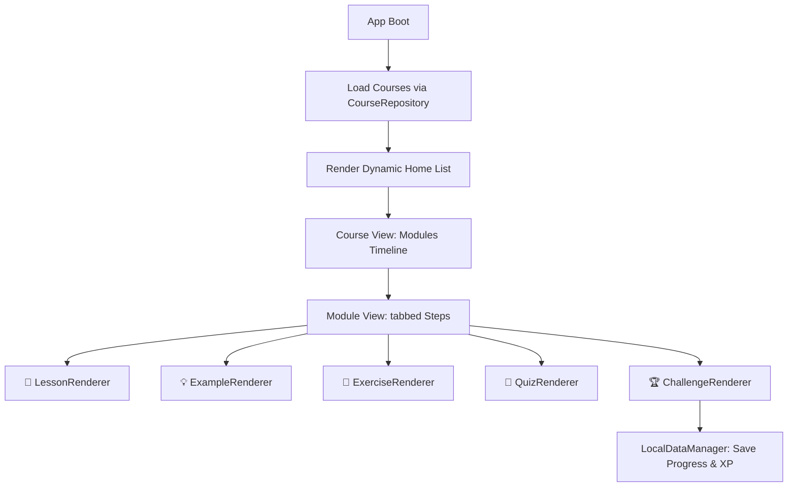

# Architecture Specification - Learning Platform Engine

Esta documentação descreve a arquitetura do **Learning Engine** do **Price Action Master**, projetado para separar completamente o aplicativo de qualquer conteúdo educacional hardcoded.

---

## 1. Visão Geral da Arquitetura

O aplicativo funciona como um interpretador puro orientando por dados (data-driven). O fluxo de execução obedece à seguinte hierarquia:

---

## 2. Componentes Fundamentais

### A. Repositório de Conteúdo (`CourseRepository`)
*   Responsável por descobrir e ler os arquivos JSON localizados na pasta `content/courses/` empacotados nos assets da aplicação.
*   Valida a integridade dos dados e retorna instâncias tipadas de `Course`.

### B. Renderizador de Interface (`LessonRenderer`, `QuizRenderer`, etc.)
*   Componentes reutilizáveis que leem os dados do respectivo passo (lesson, quiz, exercise) e os transformam em Widgets Flutter adequados.
*   **Decoupled Vector Canvas:** Utiliza o `GenericVectorPainter` para pintar linhas, textos, círculos e ineficiências de forma livre usando coordenadas proporcionais ([0.0, 1.0]).

### C. Gerenciador de Progresso (`LocalDataManager`)
*   Persiste o estado do usuário (módulos concluídos, XP adquirida, histórico de quizzes e emissão de certificados) no armazenamento seguro do dispositivo.
