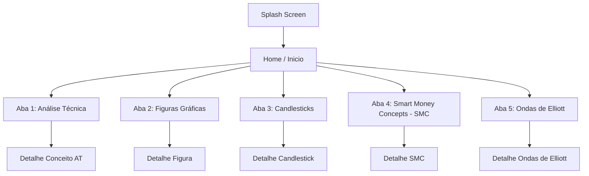

# Briefing para Design Visual e UI/UX: Price Action Master

Este documento consolida o estado atual do aplicativo **Price Action Master**, seu plano de evolução e o detalhamento funcional das calculadoras a serem integradas. Ele serve como especificação técnica e de negócios para orientar designers na criação da nova identidade visual e telas do aplicativo.

---

## 1. Visão Geral do Aplicativo
O **Price Action Master** é um aplicativo educacional e utilitário para traders de mercado financeiro (especialmente futuros de minicontratos, ações e criptoativos). 

*   **Objetivo:** Oferecer um guia rápido, de consulta rápida e offline, para padrões de velas (*candlesticks*), figuras gráficas de reversão/continuidade e conceitos de *Price Action*, além de ferramentas práticas (calculadoras e simulações).
*   **Premissa Principal:** **Custo Zero e Offline-First**. O aplicativo deve funcionar perfeitamente sem internet (usando dados locais salvos em JSON ou SQLite do aparelho) para evitar custos de servidores (como Firestore) em escala e garantir velocidade.

---

## 2. Estrutura do Aplicativo (Telas Existentes e Novas Categorias)
Atualmente, o aplicativo possui uma navegação por abas e menus, e o design deve prever as seguintes seções de conteúdo educativo:

### Detalhamento das Telas e Seções de Conteúdo:
1.  **Tela Inicial (`Inicio`):**
    *   Exibe um banner de boas-vindas do app ("Uma simples caixa de ferramentas para traders").
    *   Apresenta uma lista vertical de opções de menu que levam a todas as seções educativas e utilitárias.
2.  **Lista de Análise Técnica (`AnaliseTecnica`):**
    *   Exibe conceitos teóricos de mercado (suporte, resistência, canais, tendências).
3.  **Lista de Figuras Gráficas (`FigurasGraficas`):**
    *   Catálogo visual dos padrões geométricos do gráfico (ex: OCO, OCO Invertido, Topo Duplo, Fundo Duplo, Triângulos).
4.  **Lista de Velas Japonesas (`VelasJaponesas`):**
    *   Catálogo visual de padrões de velas individuais ou conjuntas (ex: Martelo, Doji, Estrela da Manhã, Engolfo de Alta).
5.  **Lista de Smart Money Concepts - SMC (`SMC`):**
    *   Catálogo visual de conceitos de trading institucional baseados em fluxo de ordens de grandes bancos (ex: BOS - Break of Structure, CHoCH - Change of Character, Order Blocks, Liquidez e Fair Value Gaps).
6.  **Lista de Ondas de Elliott (`OndasElliott`):**
    *   Guia estrutural sobre a teoria de ciclos e psicologia de massa descrita pelas 5 ondas impulsivas (1-2-3-4-5) e as 3 ondas corretivas (A-B-C).
7.  **Telas de Detalhe (`detalhe_a_t`, `detalhe_figura`, `detalhe_candlestick`, `detalhe_smc`, `detalhe_ondas_elliott`):**
    *   Telas dinâmicas que abrem ao clicar em um item de qualquer catálogo educativo. Apresentam o título em destaque, uma imagem ilustrativa ou esquemática de alta resolução do padrão/conceito, descrição teórica de comportamento técnico e as regras práticas de entrada/saída de operação correspondentes.

---

## 3. Especificação das Calculadoras de Contratos Futuros
Esta seção deve ser integrada como uma nova tela acessada diretamente a partir do menu da Home. 

*   **Objetivo da Tela:** Permitir que o trader selecione um contrato futuro brasileiro (BM&F) ou internacional e simule o ganho/perda financeiro e a variação em Ticks a partir de dois inputs dinâmicos: **Contratos** e **Pontos**.

### Dados Técnicos das Calculadoras para o Design:
Cada card de calculadora precisa conter os seguintes campos de entrada e saída:

| Contrato (Símbolo) | Nome / Descrição | Valor por Ponto | Ticks por Ponto |
| :--- | :--- | :--- | :--- |
| **DOL** | Dólar Cheio | R$ 50,00 | 2.0 |
| **WDO** | Mini Dólar | R$ 10,00 | 2.0 |
| **IND** | Índice Cheio | R$ 250,00 | 0.2 |
| **WIN** | Mini Índice | R$ 0,20 | 0.2 |
| **BITFUT** | Bitcoin Futuro | R$ 0,10 | 0.05 |
| **CCM** | Milho Futuro | R$ 450,00 | 100.0 |

### Elementos de UI/UX necessários em cada Card:
1.  **Cabeçalho do Card:** Nome do contrato em destaque (Ex: **DOL**) e descrição curta (Ex: *Dólar Cheio*).
2.  **Meta Info (Canto Superior Direito):** Valor do ponto (Ex: *R$ 50/ponto*) e tamanho do tick (Ex: *2 tick/ponto*).
3.  **Inputs do Usuário (Entradas numéricas editáveis):**
    *   `Contratos` (Caixa de texto numérica, padrão inicial: `1`).
    *   `Pontos` (Caixa de texto numérica, padrão inicial: `1`).
4.  **Outputs Reativos (Valores calculados em tempo real):**
    *   `TOTAL TICKS` (Resultado da multiplicação: `Pontos * Ticks por Ponto`).
    *   `RESULTADO (R$)` (Resultado financeiro: `Contratos * Pontos * Valor por Ponto`).
5.  **Rodapé do Card:** Um link ou botão de ação de "Especificações do Contrato" que, ao ser tocado, abre um modal/bottom sheet detalhando as especificações do ativo (ex: vencimento, lote mínimo, horário de operação).

---

## 4. Plano de Evolução do Aplicativo (Novas Telas)
Para o redesign, o designer deve prever espaços ou novas telas para as seguintes funcionalidades futuras:

### A. Quiz de Trade
*   **Mecânica:** Perguntas de múltipla escolha com imagens de gráficos reais. O usuário responde e recebe o feedback imediato se está correto ou errado, junto de uma explicação teórica.
*   **Elementos de UI:** Barra de progresso da rodada, placar de acertos/erros, tela de resultado final com score e botão de compartilhar.

### B. Simulador de Trade (Jogo de Trade)
*   **Mecânica:** Exibição de um gráfico estático histórico de velas (construído vela por vela). O usuário decide em determinado momento se entra **Comprado**, **Vendido** ou se deseja **Avançar** (ficar de fora). O gráfico avança e simula o resultado financeiro na conta virtual do usuário.
*   **Elementos de UI:** Mini-gráfico interativo, saldo da carteira virtual do jogador, botões destacados de COMPRA (verde) e VENDA (vermelho), e painel de histórico de operações fechadas.

### C. Tarot Trader
*   **Mecânica:** Gamificação e suporte psicológico/comportamental. O usuário escolhe uma carta do baralho de "Tarot do Trade" uma vez ao dia para obter um conselho de controle emocional e psicologia de mercado.
*   **Elementos de UI:** Animação de um baralho de cartas viradas de costas; ao escolher uma, a carta se vira revelando a arte da carta (Ex: *A Ganância*, *O Overtrading*, *A Disciplina*) e exibe o texto explicativo correspondente.

---

## 5. Diretrizes Visuais Gerais para o Designer

*   **Estilo Limpo e Consistente:** O visual deve se adaptar ao tema nativo do aplicativo, proporcionando legibilidade de gráficos na luz do dia (Light Mode) e no escuro (Dark Mode).
*   **Legibilidade:** Os termos e inputs devem ser extremamente legíveis, com fontes limpas (ex: Poppins, Inter) que facilitem a digitação rápida e leitura em smartphones.
*   **Responsividade:** O design dos cards de calculadoras e menus deve se alinhar em listas verticais em celulares pequenos e poder se distribuir em grades de duas ou mais colunas em tablets/computadores.
*   **Indicação Visual de Status:** Para as funções que dependem de progresso ou que estão bloqueadas, fornecer indicadores de estado claros (ex: cadeados elegantes, barras de progresso sutis) que não poluam a interface.
